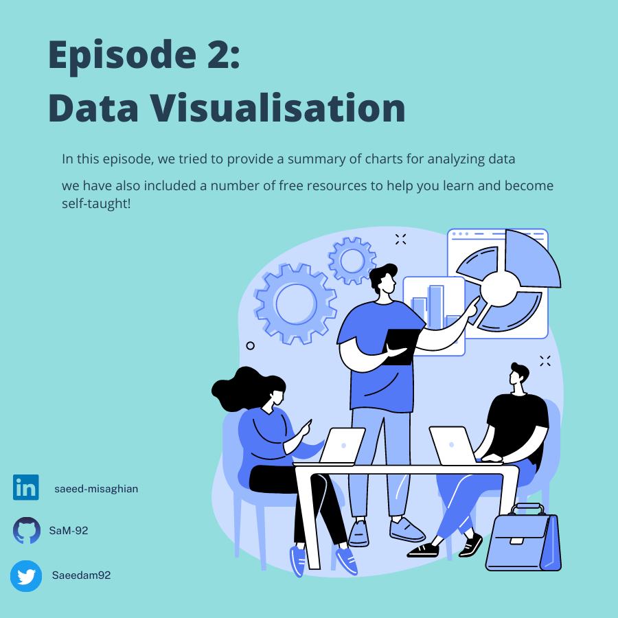
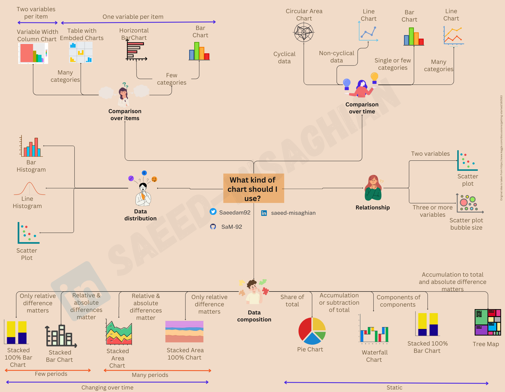

# Episode 2: Learning Python and Data Visualization!

## Which Chart is More Suitable for My Data?
💡💹Choosing the appropriate chart for data visualization is crucial in the field of data analysis! Selecting the right chart helps you present information accurately and comprehensibly to your audience. Each type of data requires a unique representation method to gain a better understanding of it.

🔍📈Using the correct chart helps you represent data clearly and interpretably. For example, if you want to compare numerical data, a bar chart or line chart may be suitable. On the other hand, if the ratio or distribution of the data is important, a pie chart or scatter plot may be appropriate.
To assist you in selecting the right chart, I have prepared the following summary, which includes various types of charts and their use cases. The primary goal is to help you choose the appropriate chart for your data.

📊📈📉Depending on your data, some adjustments and modifications may be necessary, which means these charts and summaries are not set in stone! 😊 However, I believe they are a great starting point for selecting suitable charts.

📚💻Below are some free resources for learning coding in Python and specifically creating visualizations. These selections are based on their popularity and being free, as chosen by those who have used them. I hope they prove to be helpful! 😊
I'm looking forward to your feedback! The best way to communicate with me is via Twitter if you are a Persian-speaking audience. 😊

## Free Resources for Learning this Section:
1. [Deep Learning Prerequisites: The Numpy Stack in Python V2](https://www.udemy.com/course/numpy-python/): This is a two-hour course in English that teaches you the basics of Python and data visualization for free!

2. [Kaggle](https://www.kaggle.com/search?q=visualisation): This platform offers datasets and related challenges to work with real data, allowing you to apply your data analysis skills and learn from the Kaggle community.

3.  [Data Visualization in Python Masterclass™ for Data Scientist](https://www.udemy.com/course/matplotlib-for-data-visualization-with-python-programming-language/): A 1-hour and 48-minute tutorial on drawing charts in Python!

4. [Data Visualization Repos](https://github.com/HasibAlMuzdadid/Data-Visualization/tree/main): A collection of free code samples with explanations for creating visualizations in Python. This collection is based on a course provided by IBM.

5. [IBM Data Visualization with Python](https://www.coursera.org/learn/python-for-data-visualization#modules): You can audit the course for free, but there is a cost for the certificate.

6. [Python Data Visualization Tutorial | Simplilearn](https://www.youtube.com/watch?v=Nt84_TzRkbo): A YouTube video that demonstrates code and teaches you how to create different types of visualizations.
