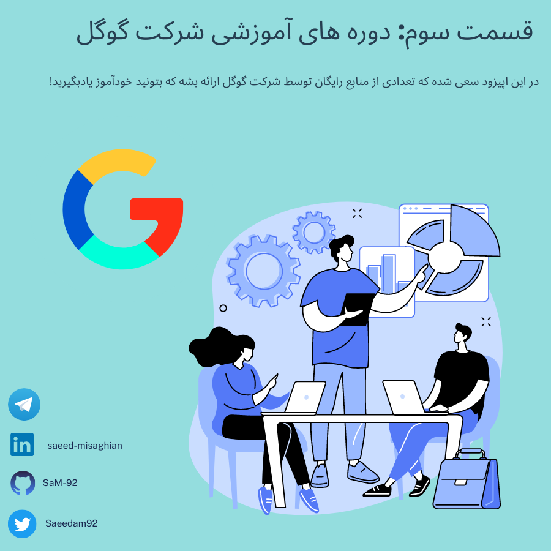
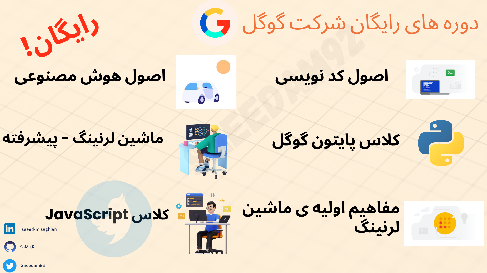

# قسمت سوم: یادگیری پایتون و ماشین لرنینگ! 

## از کجا شروع کنیم اصن کدی نویسی یاد بگیریم؟

🔍💡 شرکت گوگل به نظر میاد که این سوال رو که خیلی از شماها پرسیده بودین رو حل کرده! 

📚💻 خیلی وارد جزئیات نمیشم چون توی گراف نشون دادم که چه دوره هایی هست، در ضمن اینکه بیشترن و من اون هایی که به نظرم جالب اومدن رو براتون گذاشتم.. پس خودتون حتمااا سایت رو بررسی کنید تا اون چیزی که دوست دارید و به دردتون میخوره رو انتخاب کنید :) 

1. [Google Online courses](https://learndigital.withgoogle.com/digitalgarage/courses?category=data): کل دوره ها! 

2. [Understand the basics of code](https://learndigital.withgoogle.com/digitalgarage/course/basics-code): اصن کد چیه؟ چطوری کار میکنه؟؟ یک ساعت وقت بذارید و اینو ببینید اگر نمیدونید

3.  [Google's Python Class](https://developers.google.com/edu/python): کلاس پایتون گوگل

4. [Learn programming with JavaScript](https://learndigital.withgoogle.com/digitalgarage/course/learn-programming-with-javascript): آموزش زبان JavaScript
   
5. [Understand the basics of machine learning](https://learndigital.withgoogle.com/digitalgarage/course/machine-learning-basics): اصول ماشین لرنینگ با گوگل!

6. [Machine Learning Crash Course](https://learndigital.withgoogle.com/digitalgarage/course/machine-learning-crash-course): دوره ی پیشرفته ی ماشین لرنینگ

بقیه شون هم هست... دیگه من دونه دونه نگم :ی ..

