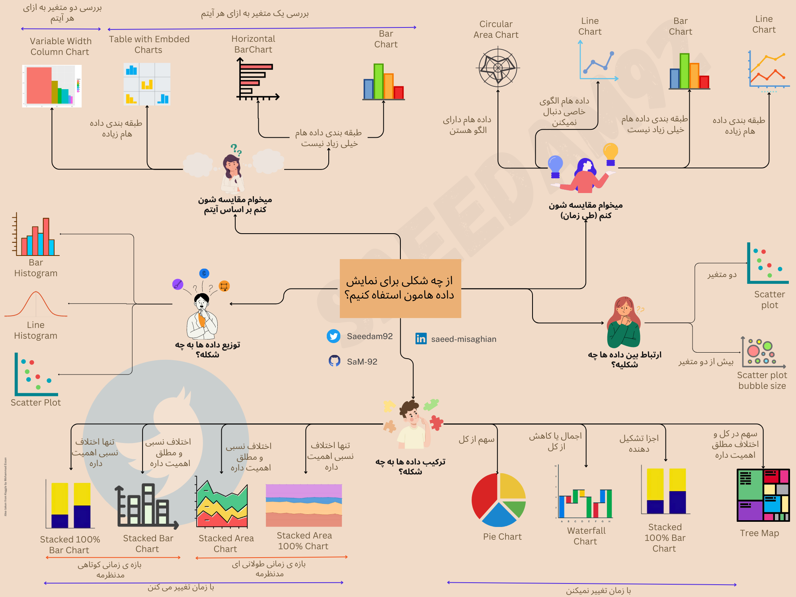

# قسمت دوم: یادگیری پایتون و رسم شکل! 

## چه نموداری برای داده های من مناسب تره؟

💡💹انتخاب چارت مناسب برای نمایش داده‌ها در حوزه تحلیل داده‌ها بسیار مهمه! انتخاب نمودار مناسب به شما کمک می‌کنه تا اطلاعات را به طور دقیق و قابل فهمی به مخاطبتون ارائه بدین. هر نوع داده‌ای نیاز به روش نمایش منحصر به فرد داره تا درک بهتری از آن پیدا کنیم.

🔍📈 استفاده از چارت درست به شما کمک می‌کنه تا داده‌ها را به طور گویا و قابل تفسیری به نمایش بذارین. مثلاً اگر میخواین داده‌های عددی را مقایسه کنید، ممکنه یک نمودار میله‌ای یا نمودار خطی مناسب باشه. از طرف دیگر، اگر نسبت یا توزیع داده‌ها مهمه، ممکنه نمودار دایره‌ای یا نمودار پراکندگی مناسب باشه.
برای کمک به شما در انتخاب نمودار صحیح،  خلاصه ی زیر رو تهیه کرده م  که شامل انواع مختلف نمودارها و مورد استفاده آنهاست.  هدف اولیه این هست که با استفاده از این خلاصه ی نمودارها شما بتونید نمودار مناسب را برای داده‌هاتون انتخاب کنید.

📊📈📉 ممکنه بر اساس داده ی شما، تنظیمات و تغییراتی نیاز باشه، یعنی میخوام بگم که این نمودار ها و خلاصه ها وحی منزل نیست! 😊 اما فکر میکنم که یک نقطه شروع  خیلی خوب برای انتخاب نمودارهای مناسب هستش. 

📚💻 در زیر تعدادی منابع رایگان برای یادگیری کدنویسی در پایتون و مخصوصا کشیدن نمودار معرفی کرده م . این انتخاب ها بر اساس رایگان بودن و محبوب بودن توسط کسایی که ازشون استفاده کردن انتخاب شده. امیدوارم مفید واقع بشن! 😊 
منتظر نظراتتون هستم! بهترین راه ارتباطی هم که توییتر هست برای من اگر مخاطب فارسی زبان هستین 😊
## منابع رایگان برای یادگیری این قسمت: 

1. [Deep Learning Prerequisites: The Numpy Stack in Python V2](https://www.udemy.com/course/numpy-python/): این یه دوره ی دو ساعته هست که به زبان انگلیسیه، رایگانه و مقدمات یادگیری پایتون و رسم شکل رو آموزش میده بتون! 

2. [Kaggle](https://www.kaggle.com/search?q=visualisation):  کگل دوره‌های رایگان آموزش تجزیه و تحلیل داده را ارائه می‌ده. این پلتفرم، مجموعه‌ها و چالش‌های مرتبط با داده‌های واقعی را فراهم می‌کنه تا بتوانید مهارت‌های تجزیه و تحلیل داده خود را به‌کار بگیرید و از جامعه کگل  یادبیگرید

3.  [Data Visualization in Python Masterclass™ for Data Scientist](https://www.udemy.com/course/matplotlib-for-data-visualization-with-python-programming-language/): آموزش 1 ساعت و 48 دقیقه ای درباره ی کشیدن نمودارها در پایتون!
  
4. [Data Visualization Repos](https://github.com/HasibAlMuzdadid/Data-Visualization/tree/main): مجموعه کدهای رایگان به همراه توضیح برای رسم شکل در پایتون. این مجموعه بر اساس دوره ی شرکت آی بی اِم تهیه شده!

5. [IBM Data Visualization with Python](https://www.coursera.org/learn/python-for-data-visualization#modules): آموزش نمایش داده با پایتون توسط شرکت آی بی اِم. میتونید دوره رو رایگان بگذرونید ولی برای مدرکش باید هزینه کنید

6. [Python Data Visualization Tutorial | Simplilearn](https://www.youtube.com/watch?v=Nt84_TzRkbo): ویدیوی یوتیوب که توش کد رو نشون میده و نحوه ی شکل کشیدن و نمودارهای مختلف رو به شما آموزش میده
