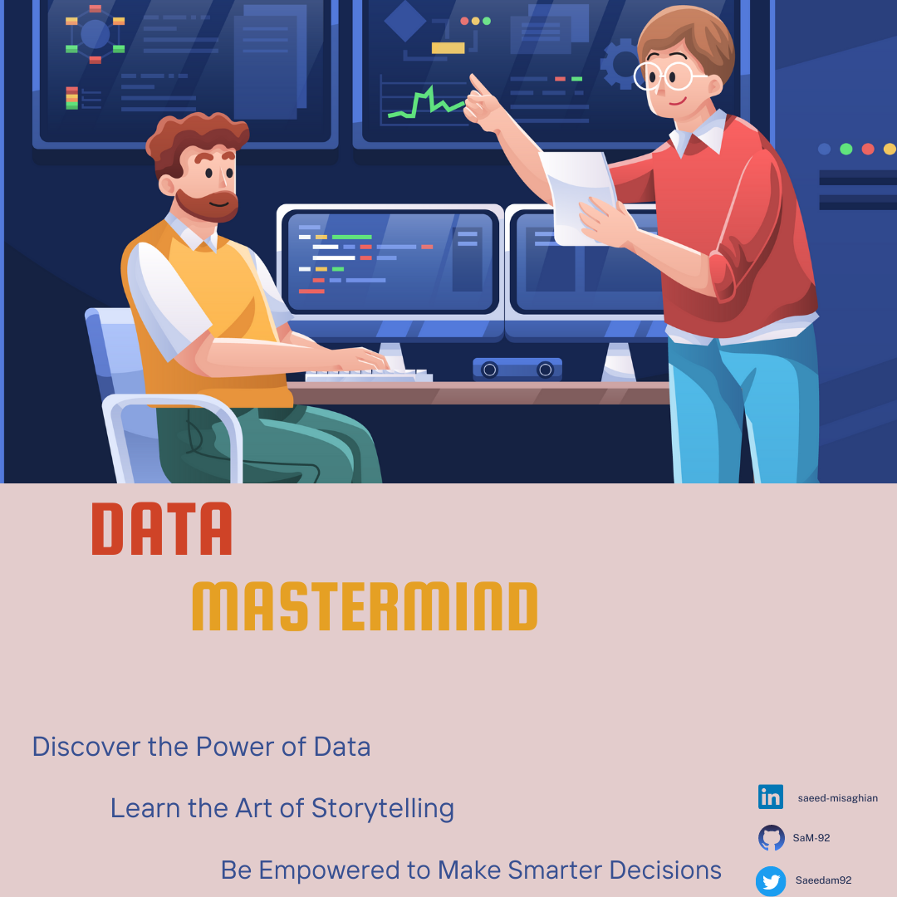

# DataScience-ML-LearningHub
# DataMastermind

Welcome to DataMastermind, a delightful collection of free resources and tutorials for Python, data science, and machine learning!

## Introduction

🥄🐍📊🤖 DataMastermind is your go-to repository for learning Python, mastering data science, and exploring the fascinating world of machine learning. Whether you're a beginner or looking to level up your skills, we've got you covered with a series of episodes packed with educational materials and practical examples.

## Episodes

📚 Each episode in DataMastermind focuses on a specific topic and provides comprehensive learning materials. We regularly update the repository with new notebooks, ensuring you have access to the latest content. Here's a glimpse of what you can expect:

- [Episode 1](https://github.com/SaM-92/DataScience-ML-LearningHub/blob/main/episode1.md): Kick Off - Introduction to Python & Data Science

🚀 In Episode 1, we kick off our journey into the world of data science with an introduction to free resources. 

- [Episode 2-Persian](https://github.com/SaM-92/DataScience-ML-LearningHub/blob/main/Persian-eposide2.md):
  
 🚀 In Episode 2, we delve into the fascinating topic of selecting the most suitable chart for our data. We explore the decision-making process behind choosing the right chart to effectively visualise our data 📊🔍✨
 
- [Episode 2-English](https://github.com/SaM-92/DataScience-ML-LearningHub/blob/main/Episode2.md):
  
 🚀 In Episode 2, we delve into the fascinating topic of selecting the most suitable chart for our data. We explore the decision-making process behind choosing the right chart to effectively visualise our data 📊🔍✨

- [Episode 3- Persian](https://github.com/SaM-92/DataScience-ML-LearningHub/blob/main/Persian-episode3.md): Goolge Learn, a free resouce to learn programming, Python, and AI 

...

Stay tuned for future episodes as we dive deeper into advanced topics, including cloud systems like AWS and Azure. We'll explore how to leverage the power of these platforms for data science and machine learning tasks, unlocking the potential of cloud computing in your projects. Whether it's deploying machine learning models, utilizing scalable resources, or harnessing cloud-based tools, we'll cover it all to help you expand your skillset and take your projects to the next level!

## Getting Started

👉 To get started, simply navigate to the desired episode's directory and explore the provided resources. Each episode contains a curated list of learning materials, including articles, tutorials, videos, and online courses, to help you delve into the specific topic. We believe in providing a variety of resources to cater to different learning preferences and levels of expertise.

While the focus of our episodes is primarily on providing external resources, there may be occasional notebooks available for certain topics. These notebooks allow for a more hands-on learning experience and can be cloned or downloaded for further exploration.

We encourage you to explore the resources provided in each episode and choose the ones that resonate with your learning style and objectives. Feel free to dive in, learn, and expand your knowledge in the fascinating fields of data science and machine learning!

## Feedback and Support

💌 We value your feedback! If you have any questions, suggestions, or encounter any issues while using DataMastermind, please open an issue on the repository. Our friendly community of learners and contributors will be happy to assist you.

## Let's Get Spooning!

🥄🚀 It's time to dive into the exciting world of Python, data science, and machine learning! Join us on this educational journey, one episode at a time. Check back regularly for updates and new materials. Let's explore, learn, and grow together with DataMastermind!

